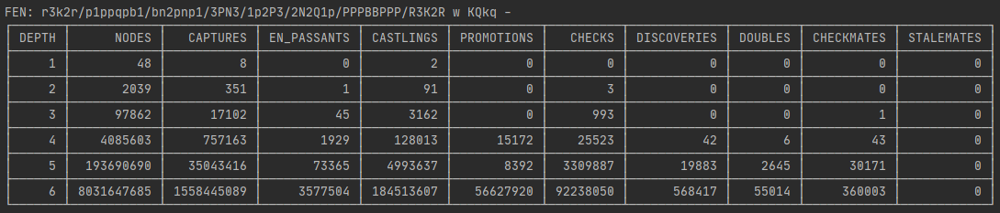

<p align="center">
  
</p>
<h1 align="center">AN.KO.BA.CH.EN</h1>

**AN.KO.BA.CH.EN** is just an acronym for **Another Kotlin Based Chess Engine**. This is a hobbyist chess engine software primarily programmed in Kotlin.

## Structure

* Board representation: [bitboards](https://www.chessprogramming.org/Bitboards)
* Movement calculation: [magic bitboards](https://www.chessprogramming.org/Magic_Bitboards)

## Features

- [x] Movement generation
- [x] FEN string parsing and generation
- [ ] PERFT calculation and movement enumeration
- [ ] Image and text based board export
- [ ] PGN file reader and writer
- [ ] Game engine for standard and Chess960 variants with UCI support
- [ ] GUI compatible wit UCI

## Get started

### Creating board

The board doesn't differentiate standard chess and 960 variant for movement generation. It is possible to create boards using [FEN](https://www.chessprogramming.org/Forsyth-Edwards_Notation) and [Shredder-FEN](https://www.chessprogramming.org/Forsyth-Edwards_Notation#Shredder-FEN) strings. 

```kotlin
// with standard piece disposition
val board1 = Board()

// with an initial piece setup of Chess 960 variant
val board2 = Board("nbnrbkqr/pppppppp/8/8/8/8/PPPPPPPP/NBNRBKQR w KQkq -")

// Philidor's mate
val board3 = Board("6rk/5Npp/8/8/8/8/1K6/8 w - - 0 1")
```

### Making movements

The movements can be made as simple as defining the origin and target squares. In order to make castling, when available, move the king on to square of participating rook piece.

```kotlin
val board = Board()
// ruy lopez opening
board.move(E2, E4)
board.move(E7, E5)
board.move(G1, F3)
board.move(B8, C6)
board.move(F1, B5)
println(board)
```

#### Listing movements

The `Board` class has some methods for listing available movements:

```kotlin
val board = Board()

// retrieve movements to the piece in the specific square
board.getMovements(Positions.E2)

// retrieve all movements of the active side
board.getMovements()

// retrieve all movements for specific side
board.getMovements(Color.BLACK)

// retrieve some random movement
board.getRandomMovement()

// iterates over each movement
board.forEachMovement() { movement ->
    // ...
}

// iterates over each movement. Within the closure, the movement already been made
board.withinEachMovement() { // this = Board
    // ...
}
```

## PERFT  calculation



