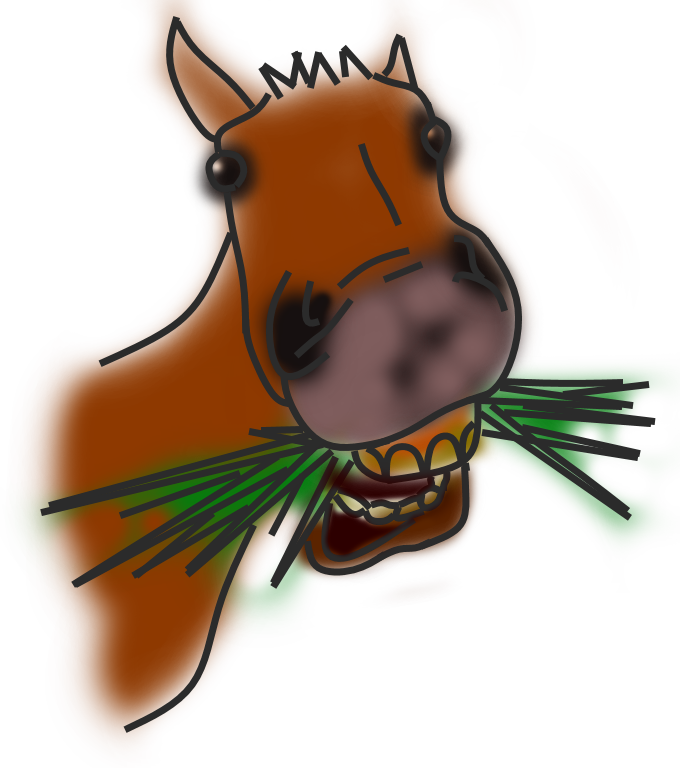

<p align="center">
  
</p>
<h1 align="center">AN.KO.BA.CH.EN</h1>

**AN.KO.BA.CH.EN** is just an acronym for **Another Kotlin Based Chess Engine**. A hobbyist chess engine
software primarily programmed in Kotlin and running over Java Platform.

## Features

* FEN parser

## Usage

### FEN parser

```kotlin
val fen FEN("r1b2r1k/4qp1p/p1Nppb1Q/4nP2/1p2P3/2N5/PPP4P/2KR1BR1 b - - 5 18")
        
// verify castling flags
println("has king side castling: ${fen.hasWhiteKingSideCastling()}")

// streams over all pieces
fen.iterator().forEach { placedPiece ->
    println(placedPiece)
}

// retrieve other information 
println(fen.getFullMoveCount())
println(fen.getHalfMoveCount())
println(fen.getColorToMove())

// retrieve bitboards with piece placements
println(fen.getBlackPiecesBitboard())
println(fen.getPawnsBitboard())
println(fen.getKingsBitboard())

// print board string representation
println(fen.toString())

// outputs
// ┌───┬───┬───┬───┬───┬───┬───┬───┐
// │ r │   │ b │   │   │ r │   │ k │
// ├───┼───┼───┼───┼───┼───┼───┼───┤
// │   │   │   │   │ q │ p │   │ p │
// ├───┼───┼───┼───┼───┼───┼───┼───┤
// │ p │   │ N │ p │ p │ b │   │ Q │
// ├───┼───┼───┼───┼───┼───┼───┼───┤
// │   │   │   │   │ n │ P │   │   │
// ├───┼───┼───┼───┼───┼───┼───┼───┤
// │   │ p │   │   │ P │   │   │   │
// ├───┼───┼───┼───┼───┼───┼───┼───┤
// │   │   │ N │   │   │   │   │   │
// ├───┼───┼───┼───┼───┼───┼───┼───┤
// │ P │ P │ P │   │   │   │   │ P │
// ├───┼───┼───┼───┼───┼───┼───┼───┤
// │   │   │ K │ R │   │ B │ R │   │
// └───┴───┴───┴───┴───┴───┴───┴───┘
```
___

### LICENSE

```text
Copyright 2024 Welyab da Silva Paula

Licensed under the Apache License, Version 2.0 (the "License");
you may not use this file except in compliance with the License.
You may obtain a copy of the License at

    http://www.apache.org/licenses/LICENSE-2.0

Unless required by applicable law or agreed to in writing, software
distributed under the License is distributed on an "AS IS" BASIS,
WITHOUT WARRANTIES OR CONDITIONS OF ANY KIND, either express or implied.
See the License for the specific language governing permissions and
limitations under the License.
```
